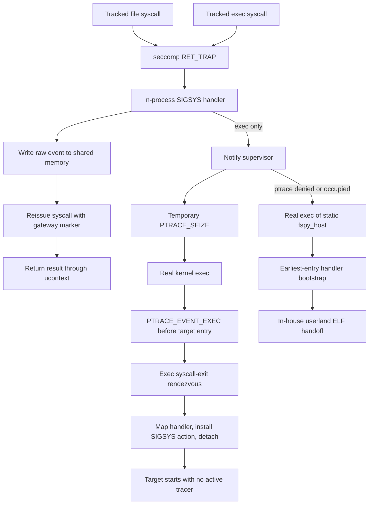

# Linux SIGSYS interception for fspy

Research date: 2026-08-02

Status: feasibility proven on native Linux AArch64 and x86-64, including default Vitest browser mode and Docker's default seccomp and AppArmor profiles. Playwright's `chromiumSandbox: true` is a confirmed compatibility boundary for the current ptrace exec bridge.

Primary audience: fspy maintainers deciding whether to replace the Linux `LD_PRELOAD` and seccomp user-notification backends.

## Decision

The design is feasible for fspy's unprivileged build-tool workload. Use `SECCOMP_RET_TRAP` and a freestanding in-process `SIGSYS` handler for Linux file-system interception. It observes libc calls and direct syscalls without the per-access process switch required by seccomp user notification.

Use two exec bridges, selected by a startup probe:

1. Prefer a temporary ptrace attachment around a real target exec. This preserves kernel ELF, script, identity, and failure semantics.
2. Do not use that bridge for Chromium's namespace-sandbox zygote exec. The current bridge breaks Chromium's synchronous zygote boot handshake before Chromium installs its seccomp policy.
3. If ptrace is denied, already owned, or incompatible with a namespace-sandbox launch, real-exec a static `fspy_host` and load the target in user space. This path works for the tested frontend workload but has a narrower, documented exec contract. Sandboxed Chromium still needs a dedicated userland-loader validation.

The preferred ptrace bridge is:

1. The in-process handler traps `execve` or `execveat`.
2. The handler asks the existing fspy supervisor to attach to that thread with `PTRACE_SEIZE` and `PTRACE_O_TRACEEXEC`.
3. The handler explicitly unblocks physical `SIGSYS`, then reissues the original syscall through a trusted gateway.
4. Linux performs the requested exec and stops at `PTRACE_EVENT_EXEC` before target code runs.
5. The supervisor advances once to the pending exec syscall-exit stop.
6. The supervisor maps the handler island into the new address space, reinstalls the physical `SIGSYS` action, and detaches.
7. File-system syscalls run with no tracer attached. Their `SIGSYS` handling stays in process.

Keep the custom loader in-house. The reference loaders were useful for finding requirements, but neither is suitable for production. Current esbuild 0.28.1, Node, shells, glibc, static musl, and static Go all passed a pure userland handoff after correcting reference-loader defects.

Do not replace both backends yet. Signal virtualization and async-signal-safe event recording remain open engineering work; syscall trapping and frontend compatibility have working proofs.

## Recommended architecture



The ptrace attachment must be temporary. A permanently traced process stops in the tracer on every signal delivery. That would turn every seccomp-generated `SIGSYS` back into a cross-process operation and remove the main performance benefit. See [`ptrace(2)`](https://man7.org/linux/man-pages/man2/ptrace.2.html).

## What the prototypes established

The primary experiments ran on Ubuntu 24.04 AArch64, Linux 6.8, in a four-vCPU Lima VM. The same syscall and injection probes passed on a native Ubuntu 24.04 x86-64 GitHub runner and inside both rootless containerd and Docker containers with an existing seccomp filter. The Docker case also had `no_new_privs=1` and `docker-default (enforce)` AppArmor.

| Question                                                                 | Result                                                                                               |
| ------------------------------------------------------------------------ | ---------------------------------------------------------------------------------------------------- |
| Can `RET_TRAP` catch direct and libc syscalls?                           | Yes; dynamic glibc, static glibc, and static musl probes passed                                      |
| Can the handler execute the denied syscall?                              | Yes; the sixth-argument gateway passed natively on AArch64 and x86-64                                |
| Can it return `EFAULT` instead of crashing on a bad pointer?             | Yes, using self `process_vm_readv`/`process_vm_writev`                                               |
| Can nested and concurrent traps work?                                    | Yes; `SA_NODEFER`, a nested trap, and 200,000 calls from four threads passed                         |
| Can Go replace or block `SIGSYS` without breaking fspy?                  | The prototype virtualized the tested `rt_sigaction` and `rt_sigprocmask` operations; esbuild passed  |
| Can a real exec regain the handler before target entry?                  | Yes; post-exec ptrace injection passed for dynamic, static, non-leader, and esbuild execs            |
| Can a recursive on-demand ptrace bridge run Vitest browser mode?         | Yes with Playwright's default `--no-sandbox`; nine exec reinjections passed on native x86-64         |
| Does the same bridge support `chromiumSandbox: true`?                    | No; the namespace zygote handshake reaches EOF at its ptrace exec boundary before Chromium seccomp   |
| Can the proposed static-host cycle bootstrap under the inherited filter? | Yes; a real exec into a static-musl second stage reinstalled the handler through the trusted gateway |
| Can a pure handoff run frontend tools?                                   | Yes; Node and esbuild 0.28.1 CLI/API paths, static Go, static musl, shells, and coreutils passed     |

The latest-esbuild ptrace experiment is the strongest combined result. It real-execed the static AArch64 esbuild 0.28.1 binary, injected a 360-byte prototype handler, detached before entry, survived Go's signal initialization and threads, intercepted the input `openat`, and produced a working bundle. The handler used an RWX page and omitted several signal cases. The result proves ordering and compatibility, while W^X mapping and complete virtualization remain production work.

## Why RET_TRAP works

For `SECCOMP_RET_TRAP`, Linux does not execute the original syscall. It sends a thread-directed `SIGSYS` with the syscall number, architecture, instruction address, and the filter's 16-bit data value. Execution resumes after the syscall instruction, so the handler must write the raw syscall result into the saved architecture return register. See the [kernel seccomp filter documentation](https://www.kernel.org/doc/html/latest/userspace-api/seccomp_filter.html), [`seccomp(2)`](https://man7.org/linux/man-pages/man2/seccomp.2.html), and the [kernel implementation](https://github.com/torvalds/linux/blob/master/kernel/seccomp.c#L1259).

The filter is inherited through `fork` and `clone` and preserved across `execve`. Unlike `SECCOMP_FILTER_FLAG_NEW_LISTENER`, an ordinary `RET_TRAP` filter can be stacked with an existing filter.

### Use the unused sixth argument as the trusted gateway marker

Every syscall in fspy's present interception set uses at most five arguments. The handler can place a random per-session 64-bit marker in the sixth raw argument register, issue the syscall from handwritten assembly, and let the BPF filter allow a tracked syscall when that marker matches.

On x86-64 the marker is placed in `r9`. On AArch64 it is placed in `x5`.

This design has three useful properties:

- It is independent of ASLR and the gateway instruction address.
- It continues to work after `fork` and after a handler island is injected into a new exec image.
- The marker remains inside the handler call. `rt_sigreturn` restores the target's original registers, so the marker does not leak into the target's next syscall.

The marker is an accidental-bypass guard, not a security boundary. Target code can discover and reuse it. fspy observes accesses; it does not sandbox the process.

Six-argument syscalls need a different gateway rule. The current file and exec syscall set does not have this problem. Future interception of `mmap`, `pselect6`, or similar calls would require an instruction-address exception or another protocol.

## SIGSYS virtualization is required

A physical fspy handler requires virtualization to coexist with arbitrary target signal state.

Linux force-delivers a seccomp `SIGSYS`. If the signal is blocked or ignored, the kernel changes its disposition to `SIG_DFL`, unblocks it, and delivers it. The process dies instead of leaving the signal pending. This behavior appears in [`force_sig_info_to_task`](https://github.com/torvalds/linux/blob/master/kernel/signal.c#L1280) and [`force_sig_seccomp`](https://github.com/torvalds/linux/blob/master/kernel/signal.c#L1811).

Go exercises this behavior during normal startup. Its runtime installs signal actions whose masks include `SIGSYS`, and it masks signals around thread creation. A backend intended to run esbuild must virtualize those operations.

The handler island must implement at least this contract:

- Install the physical handler with `SA_SIGINFO | SA_NODEFER`. `SA_NODEFER` is necessary because a gateway call can trigger a second `SIGSYS` from an outer or target-installed seccomp filter.
- Intercept every `rt_sigaction` call. Keep a logical target action for `SIGSYS`, keep the physical fspy action in the kernel, and remove `SIGSYS` from every physical handler mask. A different target handler can otherwise block physical `SIGSYS` while it runs.
- Intercept `rt_sigprocmask`. Keep the logical `SIGSYS` mask per thread, but never block it in the kernel.
- Return logical values from `rt_sigaction(..., oldact)` and `rt_sigprocmask(..., oldset)`.
- Identify fspy traps with `si_code == SYS_SECCOMP` and a dedicated `SECCOMP_RET_DATA` tag.
- Dispatch non-fspy `SIGSYS` events to the logical target action.
- Leave `rt_sigreturn` untrapped.

The prototype used one logical mask for the process. Production needs a per-TID mask table and inheritance rules for `clone`/`clone3`; Go changes masks around thread creation. Lifecycle syscalls may need their own rare, supervisor-assisted slow path because reissuing a thread-creating `clone` from a C signal frame is not generally safe when the child receives a new stack.

The first implementation can declare narrower behavior for `signalfd`, `sigwait`, temporary-mask syscalls such as `pselect6` and `epoll_pwait`, target-written `ucontext.uc_sigmask`, direct `rt_sigreturn`, `CLONE_CLEAR_SIGHAND`, and `SIGSYS` queued by another process. These cases require deeper signal emulation.

### Do not take ownership of the target alternate signal stack

Linux provides one alternate signal stack per thread. Reserving it for fspy breaks target handlers that use `SA_ONSTACK`, including runtimes that use an alternate stack for overflow or fault handling.

The production handler should run on the interrupted target stack and keep its stack use bounded. A userland loader must transfer control only after the target stack is valid. If a dedicated fspy alternate stack is retained as an optional hardening mode, the implementation must virtualize `sigaltstack` and target `SA_ONSTACK` delivery.

## Async-signal-safe event recording

The handler cannot call the current preload client. It must avoid libc, allocation, TLS, locks, unwinding, and callbacks into the target runtime.

The injected artifact can be written in freestanding Rust. The [Rust injected-runtime design](fspy-rust-injected-runtime.md) includes a cross-compiled relocation-free blob, raw syscall and restorer assembly, a separate state ABI, and the fixed-capacity lock-free allocator decision. Allocation remains prohibited in the `SIGSYS` fast path.

Use a target-independent shared-memory ABI with fixed-size records and a bounded byte area for paths. Reserve records with lock-free atomics; wake the supervisor with raw `futex` or `eventfd` operations. If the ring fills, block on a raw primitive and never drop a cache-relevant access. Partitioning record lanes by TID reduces contention and simplifies nested delivery.

Copy target pointers with bounded self `process_vm_readv`. Direct loads can turn a target `EFAULT` into a recursive fault in the handler. The full `openat` prototype copied the path this way and reissued the syscall, but it did not normalize the path or record an event. Production must resolve cwd/dirfd state before returning to the target or capture enough stable fd identity for the supervisor; deferring a raw pointer or fd introduces close/reuse races.

## Real exec with a temporary ptrace attachment

`PTRACE_EVENT_EXEC` occurs after Linux has installed the new image and reset exec-owned state, but before the new program executes an instruction. It also occurs before the pending exec syscall finishes returning. The ordering is visible in [`fs/exec.c`](https://github.com/torvalds/linux/blob/master/fs/exec.c#L1747) and the [x86-64 syscall return path](https://github.com/torvalds/linux/blob/master/arch/x86/entry/syscall_64.c).

The exec handler can use this sequence:

1. Write an exec request containing the current TID and logical signal state to a preinitialized channel.
2. Wait for the supervisor to call `PTRACE_SEIZE` with `PTRACE_O_TRACEEXEC`.
3. Unblock physical `SIGSYS`, then reissue the original `execve` or `execveat` with the sixth-argument gateway marker. Preserve the original path, argv, environment, fd, and flags.
4. On success, handle the exec event under the post-exec thread-group-leader TID. `PTRACE_GETEVENTMSG` reports the former TID for a nonleader exec.
5. Resume once with `PTRACE_SYSCALL` and `PTRACE_O_TRACESYSGOOD`, then require the pending exec syscall-exit stop. This prevents the late exec return from overwriting registers prepared for the first injected syscall; x86-64 uses `rax` for both the syscall number and return value.
6. Remote-map a sealed, position-independent handler artifact and its state mapping.
7. Install the physical `SIGSYS` action and force the physical mask to unblock `SIGSYS`.
8. Restore the target's entry registers and any instruction bytes overwritten for injection.
9. Detach with no delivered signal.

Remote injection syscalls are also evaluated by inherited seccomp filters. Set the gateway marker on remote `mmap`, `mprotect`, and `rt_sigaction` calls that fspy itself traps. A stronger target or outer filter can still reject an operation.

If exec fails, the old address space and signal frame remain. The handler reports the failure, the supervisor uses `PTRACE_INTERRUPT`, detaches at the resulting stop, and wakes the handler to return the raw exec error. This path must not leave a failed exec caller traced.

The AArch64 proof passed dynamic and static targets, 20 repeated launches, sanitizers, and a non-leader pthread exec. At non-leader exec, Linux reported the event under the thread-group leader TID and `PTRACE_GETEVENTMSG` returned the former worker TID, so the supervisor must re-key per-thread state. The latest-esbuild proof measured the interval from `PTRACE_EVENT_EXEC` to detach over 30 runs: 78.7 microseconds p50, 101.8 microseconds p95, and 84.7 microseconds mean. This is the exec-only cost; no tracer remained for file syscalls.

The recursive x86-64 proof now exercises the production-shaped success path end to end. The handler sends a queued real-time signal containing its TID and a release-word address, waits in a futex, and lets an ancestor supervisor attach with on-demand `PTRACE_SEIZE`. The supervisor releases the handler, observes `PTRACE_EVENT_EXEC`, injects an RX code page plus a separate RW state page, and detaches. No inherited control fd is required, so `posix_spawn` close actions cannot sever the bridge. Failed-exec behavior is implemented but still needs a dedicated compatibility matrix.

A subtle signal-mask rule is mandatory. `SIGSYS` is automatically blocked while its handler runs. If that handler successfully calls `execve`, there is no later `rt_sigreturn` to restore the old mask, and the new image inherits `SIGSYS` blocked. Its first trapped syscall is then fatal. The handler must explicitly unblock physical `SIGSYS` immediately before the gateway exec. This was the only ptrace-protocol defect exposed by the shell-to-Node startup chain.

The native x86-64 [Vitest browser validation](https://github.com/voidzero-dev/vite-task/actions/runs/30735989574) ran the repository's real fixture with Node 22.19.0, Vitest 4.1.10, `@vitest/browser-playwright` 4.1.10, Playwright 1.61.1, and Chrome Headless Shell 149.0.7827.55. It reinjected nine successful images—dash, sed, dirname, uname, Node, and four Chromium processes—with zero failed execs. The browser test and JSON report passed while the inherited filter trapped and reissued the representative file-syscall set: `openat`, `openat2`, `newfstatat`, `statx`, `getdents64`, `faccessat`, and `faccessat2`.

This proves compatibility with Vitest's default Playwright Chromium launch, which disables Chromium's sandbox unless `chromiumSandbox: true` is requested.

### `chromiumSandbox: true` fails at the namespace-zygote exec boundary

The current ptrace exec bridge does not support Playwright's `chromiumSandbox: true`. This is a confirmed negative result, not a missing host prerequisite.

The native Ubuntu 24.04 validation established these controls:

- A direct Playwright launch with `chromiumSandbox: true` passed.
- The same direct launch under `setpriv --no-new-privs` passed.
- The full bridge continued to pass Vitest with Playwright's default `chromiumSandbox: false`.
- The sandboxed launch used no `--no-sandbox` argument.

Ubuntu 24.04's AppArmor policy restricts unprivileged user namespaces by default on the GitHub runner. The validation explicitly set `kernel.apparmor_restrict_unprivileged_userns=0`. Without that host setup, Chromium fails earlier with `No usable sandbox`; that is a separate environment failure.

With the host prerequisite satisfied, the bridged launch fails in this order:

1. The bridge injects the main Chrome image successfully.
2. Chrome creates its namespace zygote and the bridge injects that exec successfully. `/proc/<zygote>/fd/3` still reports the inherited Unix socket.
3. The browser's blocking `recvmsg` returns zero at the zygote exec boundary. Chromium fails `ReceiveFixedMessage` at `zygote_host_impl_linux.cc:207` before receiving `ZYGOTE_BOOT`.
4. The zygote reaches `ZygoteMain` after detach. Its later control-socket write reports `EPIPE` because the browser has already abandoned the handshake.

The [full-filter diagnostic run](https://github.com/voidzero-dev/vite-task/actions/runs/30737025514) captured the zero-length receive, the preserved fd 3, and the later broken pipe. An [exec-and-signal-only filter run](https://github.com/voidzero-dev/vite-task/actions/runs/30737143580) failed at the same point. The representative file-syscall traps are therefore not the cause.

Chromium's own seccomp policy is not active at this failure point. Forwarding a foreign `SECCOMP_RET_TRAP` to the target's logical `SIGSYS` handler and installing fspy's physical handler with `SA_NODEFER` are still required. The standalone nested-filter test validates those mechanics, but they do not fix this earlier zygote handshake.

Treat namespace-sandbox zygote exec as a ptrace incompatibility until a different rendezvous proves otherwise. A production hybrid should route this exec through the static-host userland loader or decline tracing with an actionable error. It must make that choice before attempting the ptrace exec because Chromium treats the failed boot handshake as fatal.

This path preserves the parts of exec that frontend tools depend on:

- kernel ELF, script, and binfmt loading;
- static and dynamic executables, including Go binaries;
- destruction of sibling threads;
- `vfork` parent release;
- close-on-exec and file-table unsharing;
- target `/proc/self/exe`, auxv, comm, memory layout, and brk state;
- kernel handling of ELF properties and the platform dynamic linker.

Installing an unprivileged seccomp filter requires `no_new_privs`, which puts target set-user-ID, file-capability elevation, and similar privileged exec transitions outside the supported contract.

### Ptrace limitations

Use a startup capability probe and choose the fallback before doing substantial work. Temporary attachment can fail when:

- another debugger, `strace`, or `rr` owns the one ptrace relationship;
- Yama is in a restrictive mode;
- `PR_SET_DUMPABLE(0)` or a credential transition prevents attachment;
- AppArmor, SELinux, a container profile, or a sandbox denies ptrace;
- a descendant is no longer in an allowed ancestor relationship with the supervisor.

For normal Yama mode 1, the fspy supervisor is an ancestor of the tracked process. `PR_SET_PTRACER` can cover descendants whose ancestry changes, subject to the surrounding policy.

## Userland exec fallback

An in-house loader is feasible for ordinary build tools. Existing projects should be used as references, not adopted without modification.

Each logical exec must first perform a trusted real exec of a fresh static `fspy_host`. That kernel transition kills sibling threads, releases a `vfork` parent, closes `CLOEXEC` descriptors, clears the alternate stack, resets caught signal dispositions, and discards the old address space. These generic effects match the requested target exec. Keep the host single-threaded until handoff.

The inherited filter is active while the kernel has reset the handler. A normal dynamic loader or unaudited C runtime can die before `main`. Give the static PIE host a custom earliest entry that installs `SIGSYS` with a raw, marker-bypassed `rt_sigaction` before any intercepted syscall. The static-musl bootstrap experiment passed this exec-filter-handler cycle; production should not depend on the observed musl startup sequence.

Preserve the logical argv and environment exactly when real-execing the host. Pass target metadata through a reserved inherited fd or a hidden entry that is removed before handoff. Do not prefix argv with `fspy_host` and the target. This keeps `/proc/self/cmdline`, `argv[0]`, and language-level argv behavior closer to a real exec.

The fallback should start with these supported forms on x86-64 and AArch64:

- dynamic PIE and dynamic non-PIE;
- static `ET_EXEC`;
- static PIE with documented relocation types;
- glibc and musl startup;
- Go executables such as esbuild;
- Linux shebang recursion and argument construction.

The loader must use a bounded ELF parser, reserve the full image before mapping, map target segments from the target fd where possible, zero BSS correctly, enforce final W^X permissions, support `PT_INTERP`, and construct an accurate owned initial stack and auxv. It must keep the handler, restorer, gateway, and state in a collision-checked survivor island, then guard that island from target `MAP_FIXED`, `mremap`, `munmap`, and `mprotect` calls.

The compatibility matrix passed dynamic PIE/non-PIE glibc, static musl, static Go, Node workers and children, shells, coreutils, esbuild 0.28.1 CLI, and the Node esbuild API service path. Neither reference loader accepted a shebang directly, but expanding the same script to its interpreter passed. Script parsing is an implementable host feature.

One useful failure illustrates why the loader should be in-house. The Anvil reference placed `AT_RANDOM` at a word index treated as a byte offset. Go 1.23 and newer overwrite the 16-byte seed after reading it, corrupting adjacent argv data. Supplying owned random bytes fixed current esbuild. Libreflect passed a broader matrix but still has unchecked placement and incorrect auxv entries.

The fallback retains target-specific differences:

- `/proc/self/exe` and external process identity refer to the host;
- target credential, LSM, IMA, and audit exec hooks do not run;
- kernel auxv and mm metadata describe the host unless individual queries are virtualized;
- generic binfmt and target-specific ELF-property behavior is incomplete;
- the host's kernel brk, executable-file accounting, dumpability, and other mm-owned state can differ from the target's expected exec image;
- after kernel exec commits to the host, a later target parse or mapping error cannot return the original exec error to the old image.

Virtualize in-process `/proc/self/exe`, `/proc/self/auxv`, and `PR_GET_AUXV` queries, and recognize logical self-reexec. This should address the Node and Go self-reexec failures observed with unmodified reference hosts. It cannot change what external observers, audit, ptrace, or the kernel see.

Reject set-user-ID, set-group-ID, file-capability, target-specific LSM, mandatory-map collision, and exact external-identity cases with an actionable error. `no_new_privs` already prevents privilege elevation, but an explicit contract is better than accidental behavior. Preflight the target before committing to the host exec to reduce, but not eliminate, post-commit failures.

The static host also needs a target-independent payload ABI. The current `Payload` and shared-memory channel schemas differ between glibc and musl builds because fields are compiled out under `target_env = "musl"`. A new host protocol must not use target-conditional serialization.

## Environment compatibility

| Environment                  | RET_TRAP syscall path | Temporary ptrace exec     | Evidence or required handling                                         |
| ---------------------------- | --------------------- | ------------------------- | --------------------------------------------------------------------- |
| Native Linux AArch64         | Passed                | Passed                    | Ubuntu 24.04/Linux 6.8; dynamic, static, esbuild, and non-leader exec |
| Native Linux x86-64          | Passed                | Passed with boundary      | Ubuntu 24.04; default Chromium passes, namespace-sandbox zygote fails |
| WSL2                         | Expected              | Expected, untested        | Avoid `NEW_LISTENER`; test mirrored networking and ptrace policy      |
| Rootless containerd          | Passed                | Passed                    | Existing seccomp filter; also passed with `no_new_privs=1`            |
| Docker default on Linux      | Passed                | Passed                    | Existing filter, `no_new_privs=1`, enforced default AppArmor          |
| Docker Desktop amd64/Rosetta | Unsupported           | Not reached               | Local `PR_SET_SECCOMP` returned `EINVAL`; use a native-arch image     |
| Kubernetes                   | Runtime-dependent     | Runtime and LSM-dependent | Probe and fall back; test containerd/CRI-O RuntimeDefault profiles    |
| Hosted CI                    | Passed on GitHub      | Passed with boundary      | GitHub passes except sandboxed Chromium; other providers need a probe |
| Custom sandbox               | Policy-dependent      | Often denied              | Use the userland fallback or report an actionable error               |

The default-browser native x86-64 and Docker evidence is recorded in [GitHub Actions run 30735989574](https://github.com/voidzero-dev/vite-task/actions/runs/30735989574). The Docker recursive bridge passed with `Seccomp: 2`, `NoNewPrivs: 1`, and `docker-default (enforce)`. The sandboxed-Chromium boundary is recorded separately in [run 30737025514](https://github.com/voidzero-dev/vite-task/actions/runs/30737025514). The Rosetta result is an emulation limitation, not a failure of native x86-64 Docker.

The open [WSL issue about seccomp notification](https://github.com/microsoft/WSL/issues/9548) concerns the single `NEW_LISTENER` restriction when WSL mirrored networking already owns a listener. It does not prevent stacking a normal `RET_TRAP` filter. The current WSL kernel configuration enables seccomp filtering.

Docker's [default seccomp profile](https://github.com/moby/profiles/blob/main/seccomp/default.json) allows `seccomp`, `prctl`, exec, signal operations, and ptrace/process-vm operations on kernels at least 4.8. The current [Docker AppArmor template](https://github.com/moby/profiles/blob/main/apparmor/template.go) allows tracing between processes in the same container profile, subject to Yama and other LSM rules. Kubernetes `RuntimeDefault` is selected by the runtime, so it is not a portable guarantee. See the [Kubernetes kernel security constraints](https://kubernetes.io/docs/concepts/security/linux-kernel-security-constraints/).

## Performance expectations and measurements

The expected ordering is:

```text
LD_PRELOAD < in-process RET_TRAP < seccomp user notification
```

`RET_TRAP` constructs and restores a full signal frame, runs the handler, and often issues the real syscall a second time. The measurements below quantify its advantage over waking a supervisor, reading target memory from another process, recording the event there, and sending a notification response.

Five pinned runs of the controlled AArch64 prototype produced these medians:

| Path                                                |      Median |          Relative to matching baseline |
| --------------------------------------------------- | ----------: | -------------------------------------: |
| Direct `getpid`, no filter                          |    115.6 ns |                                  1.00x |
| Trap and set the result register                    |    565.8 ns |                                  4.93x |
| Trap and reissue through the gateway                |    713.7 ns |                                  6.17x |
| `openat("/dev/null")` plus `close`, no filter       |    531.7 ns |                                  1.00x |
| Trap, safe path copy, `openat` reissue, and `close` |  1,451.7 ns |                                  2.72x |
| User notification, emulated result                  | 13,922.7 ns | about 122x the direct-syscall baseline |
| User notification with `CONTINUE`                   | 13,931.4 ns | about 123x the direct-syscall baseline |

The representative filesystem trap was about 9.6 times faster than the user-notification round trip. It excludes absolute-path normalization and shared-memory recording, so it is a lower bound for the new backend. The user-notification probe also excludes fspy path processing, making the process-boundary comparison conservative.

One native x86-64 GitHub runner produced the same ordering: 133.0 ns for direct `getpid`, 2,782.5 ns for trap and reissue, and 29,798.4 ns for user notification with `CONTINUE`. On that runner the in-process path was 10.7 times faster than user notification. Trapped `openat` plus `close` took 6,956.1 ns versus a 2,611.5 ns unfiltered baseline, or 2.66x. These are single-run CI observations rather than pinned-run medians.

The minimal preload interposer was indistinguishable from the untracked `openat` baseline, about 0.53 microseconds. That is only dispatch cost; it does not record an event and direct syscalls bypass it. `LD_PRELOAD` remains the performance floor.

The [current main-branch x86-64 fspy benchmark](https://github.com/voidzero-dev/vite-task/actions/runs/30639476712) from 2026-07-31 reports:

| Current backend                  | Launch overhead | Access overhead |
| -------------------------------- | --------------: | --------------: |
| Dynamic `LD_PRELOAD`             |         +60.07% |         +53.43% |
| Static seccomp user notification |        +154.49% |        +965.35% |

These percentages use different dynamic and static target binaries. They establish the current cost range, not a controlled three-way comparison.

The persistent `SECCOMP_RET_TRACE` experiment in [draft PR #575](https://github.com/voidzero-dev/vite-task/pull/575) reinforces the design choice. Its [benchmark run](https://github.com/voidzero-dev/vite-task/actions/runs/30353491853) kept a tracer attached and measured static access at +938% over untracked, 11.49% slower than the user-notification base in that run. Ptrace is useful only as the short exec bridge; keeping it attached does not solve the process-switch cost.

Post-exec handler injection measured 78.7 microseconds p50 and 101.8 microseconds p95 in the AArch64 VM. This is paid once per successful exec, not per file access.

Before rollout, extend the benchmark to report:

- a raw syscall baseline;
- trap plus register emulation;
- trap plus shared-memory recording and absolute-path resolution;
- 1, 2, 8, and 32 concurrent threads;
- open/stat/readdir and exec-heavy workloads;
- p50, p95, and p99, plus frontend-tool wall time and CPU time.

Add forced backend selection to the existing benchmark so the same dynamic and static workloads compare untracked, preload, user notification, and SIGSYS on one machine.

## Implementation map

The current backend decision is in `crates/fspy_shared_unix/src/spawn/linux/mod.rs`. It inspects the ELF interpreter and chooses either `LD_PRELOAD` or a seccomp user-notification `pre_exec` hook. The new backend removes that per-executable choice.

A staged implementation should use these boundaries:

1. Add a Linux-only `fspy_sigsys` crate with filter generation, architecture register access, the raw gateway, and a freestanding handler artifact.
2. Define a stable `repr(C)` or manually encoded host/handler configuration that is identical for glibc, musl, and freestanding artifacts.
3. Add a raw lock-free shared-memory event format. Do not call the current preload `Client` from the signal handler because it uses runtime facilities and target-conditional types.
4. Implement process-wide virtual `SIGSYS` action state, per-TID masks, action-mask sanitization, and the declared compatibility boundary for the remaining signal APIs.
5. Add an exec coordination service beside the current supervisor lifecycle in `crates/fspy/src/unix/mod.rs`.
6. Implement post-exec injection for x86-64 and AArch64, including the x86-64 `SA_RESTORER` trampoline, TID re-keying, W^X mappings, and exec-failure detach.
7. Build the custom-entry static host and in-house loader as the ptrace-denied fallback. Keep target metadata out of logical argv and environment.
8. Replace preload and user-notification selection only after forced-backend differential tests pass. Keep forced legacy modes for bisecting regressions during rollout.

## Validation gates

Do not make SIGSYS the default until all of these gates pass:

1. Every syscall in the tracked set produces the same cache-relevant event for libc and direct-syscall callers.
2. Invalid pointers return `EFAULT` without crashing the handler.
3. Go and esbuild survive signal installation, thread creation, direct file syscalls, subprocesses, and repeated exec.
4. Node, npm/pnpm/yarn, Vite, Vitest, Rolldown, oxlint, Bun, Deno, and Playwright complete representative workloads with output and exit-status parity.
5. Shell scripts, `posix_spawn`, `fork`, `vfork`, multithreaded exec, `execveat(AT_EMPTY_PATH)`, and failed exec preserve observable behavior.
6. Ubuntu glibc, Alpine musl, WSL2, Docker default/rootless, and representative Kubernetes profiles either run or select a documented fallback.
7. x86-64 and AArch64 run the same functional suite. Compat x32/i386 must be rejected with a clear error or implemented.
8. Performance is measured with forced backends on identical target binaries and real frontend workloads.

## Remaining risks

- Full logical SIGSYS behavior is a small signal-compatibility layer, not a single intercepted `sigaction` call.
- Per-thread logical mask inheritance across `clone` is not solved by the current prototype.
- Fault-safe in-process pointer reads add work. `process_vm_readv` works for the prototype but can be denied by policy; direct reads turn an `EFAULT` case into a potential crash.
- Correct event recording needs bounded backpressure and stable cwd/dirfd resolution without target runtime locks.
- An outer seccomp filter can return a stronger action. `KILL` remains fatal; an outer `TRAP` requires correct nested dispatch.
- The handler mapping must be position-independent, W^X-clean, collision-checked, and independent of libc, TLS, allocation, locks, and unwinding.
- The sixth-argument gateway is not a security boundary.
- Ptrace injection conflicts with another tracer and can be denied after startup, so fallback selection must also handle a later capability loss.
- The userland fallback cannot reproduce target kernel identity/security hooks, and target-loading failures after host exec are irreversible.

## Sources and verification

This decision is grounded in the repository's current fspy implementation, Linux kernel documentation and source, the supplied userland-exec evaluation, and these reproducible artifacts:

- [`research/sigsys-prototype/README.md`](../research/sigsys-prototype/README.md): trap semantics, signal virtualization, static-host bootstrap, esbuild, and controlled timings
- [`research/ptrace-exec-prototype/README.md`](../research/ptrace-exec-prototype/README.md): post-exec handler injection
- [`research/ptrace-exec-prototype/ESBUILD_RESULTS.md`](../research/ptrace-exec-prototype/ESBUILD_RESULTS.md): latest esbuild, non-leader exec, and injection latency
- [`research/userland-exec-compat/RESULTS.md`](../research/userland-exec-compat/RESULTS.md): frontend and ELF compatibility matrix

Key repository entry points:

- `crates/fspy/src/unix/mod.rs`
- `crates/fspy_shared_unix/src/spawn/linux/mod.rs`
- `crates/fspy_preload_unix/src/client/mod.rs`
- `crates/fspy_seccomp_unotify/src/supervisor/mod.rs`
- `crates/fspy/src/unix/syscall_handler/mod.rs`
- `crates/fspy_benchmark/README.md`

Primary external references:

- [Linux seccomp filter documentation](https://www.kernel.org/doc/html/latest/userspace-api/seccomp_filter.html)
- [`seccomp(2)`](https://man7.org/linux/man-pages/man2/seccomp.2.html)
- [`execve(2)`](https://man7.org/linux/man-pages/man2/execve.2.html)
- [`signal(7)`](https://man7.org/linux/man-pages/man7/signal.7.html)
- [`sigaction(2)`](https://man7.org/linux/man-pages/man2/sigaction.2.html)
- [`ptrace(2)`](https://man7.org/linux/man-pages/man2/ptrace.2.html)
- [Linux syscall user dispatch](https://www.kernel.org/doc/html/latest/admin-guide/syscall-user-dispatch.html)
- [WSL seccomp-notify issue](https://github.com/microsoft/WSL/issues/9548)
- [Docker default seccomp profile](https://github.com/moby/profiles/blob/main/seccomp/default.json)

Syscall user dispatch was considered and rejected for the main design. It is per-thread and is reset by `fork`, `clone`, and `exec`, which makes transparent thread/process coverage harder than an inherited seccomp filter.
