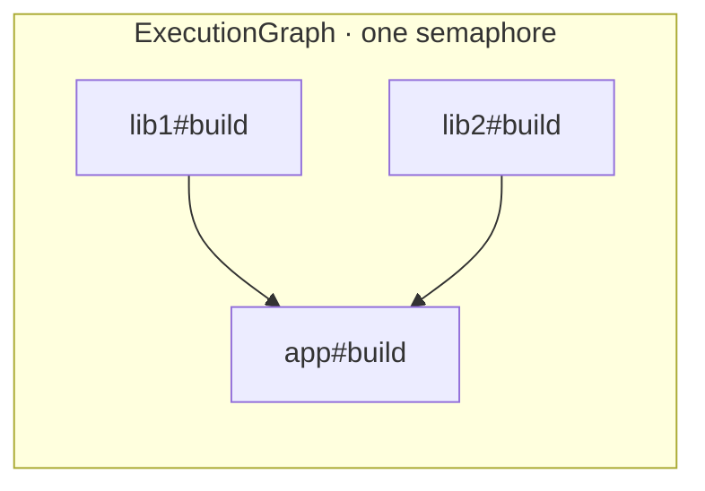
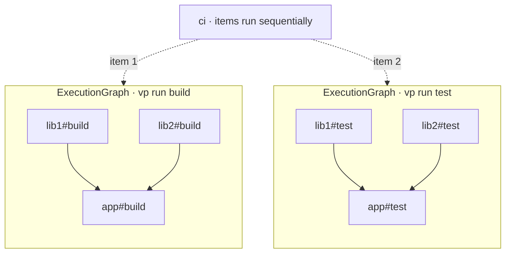
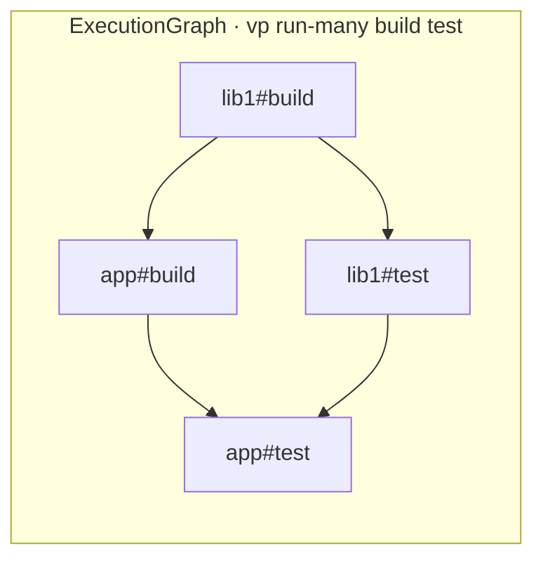
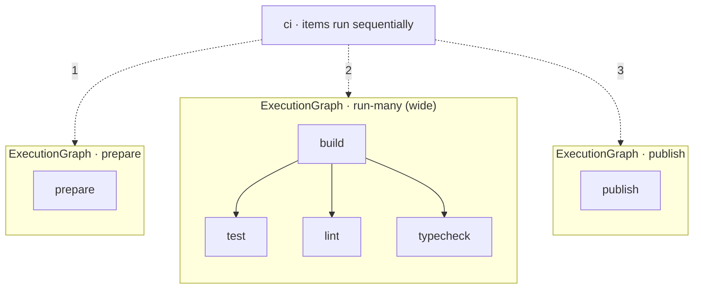

# RFC: `run-many`

## Two scheduling structures

vite-task schedules work using two structures nested inside each other: a **graph** (what the scheduler runs) and a **tree** (recursion of graphs).

### Graph

An `ExecutionGraph` is a DAG of tasks with its own concurrency limit and its own semaphore. The scheduler runs nodes whose dependencies have finished, up to the limit. Dependency-aware parallelism lives here.

`vp run -r build` when `app` depends on `lib1` and `lib2`:



Arrows mean "runs before". `lib1#build` and `lib2#build` run in parallel; `app#build` waits for both.

### Tree

A task's `command` splits on `&&` into **items** that run in order. An item is either a leaf process or `Expanded`: a nested `ExecutionGraph` built from a `vp run` inside the command. Every `Expanded` item gets its own graph with its own semaphore.

After #381, `command: ["vp run build", "vp run test"]` is shorthand for `"vp run build && vp run test"`. So `string[]` is how you sequence siblings in the tree.

`"ci": { "command": ["vp run build", "vp run test"] }`:



`G1` finishes before `G2` starts. The two graphs are isolated: separate semaphores, nothing connects them.

## What's missing

You can get dependency-aware parallelism inside one graph, and you can sequence siblings in the tree. What you can't say today is:

> Run several tasks plus their dependencies as one DAG. Fan out where they're independent, serialize where they actually depend on each other.

Each `vp run` produces a graph with a single requested root, so this can't happen inside one tree node. Siblings under `items` run sequentially, so it can't happen across tree nodes either. `--parallel` works around it by dropping every dependency edge, which is too blunt when some deps are real.

## `run-many`

`vp run-many <task1> <task2> ...` builds one graph with multiple requested roots. All `run` flags apply. The graph is the union of the per-task graphs, dedup'd by node.

`vp run-many build test` where `test` depends on `build`:



`lib1#test` starts the moment `lib1#build` finishes. It doesn't wait for `app#build`. `--parallel` can't give you this schedule because it would drop the `test → build` edge entirely. `["vp run build", "vp run test"]` can't either, because no test starts until every build is done.

## Composition

`string[]` for sequencing and `run-many` for fan-out compose cleanly:

```jsonc
{
  "ci": {
    "command": [
      "vp run prepare",
      "vp run-many lint test build typecheck",
      "vp run publish"
    ]
  }
}
```



`prepare` runs alone. Then the wide graph: `lint`, `test`, `typecheck` start the moment `build` finishes, all sharing one semaphore. Then `publish`.

| Primitive         | Effect                                            |
| ----------------- | ------------------------------------------------- |
| `ExecutionGraph`  | Dependency-aware parallelism within one semaphore |
| `command: [...]`  | Sequence sibling graphs in the tree               |
| `vp run`          | Spawn one child graph                             |
| `vp run-many`     | Spawn one wide child graph (multiple roots)       |
