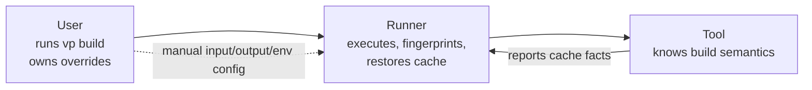
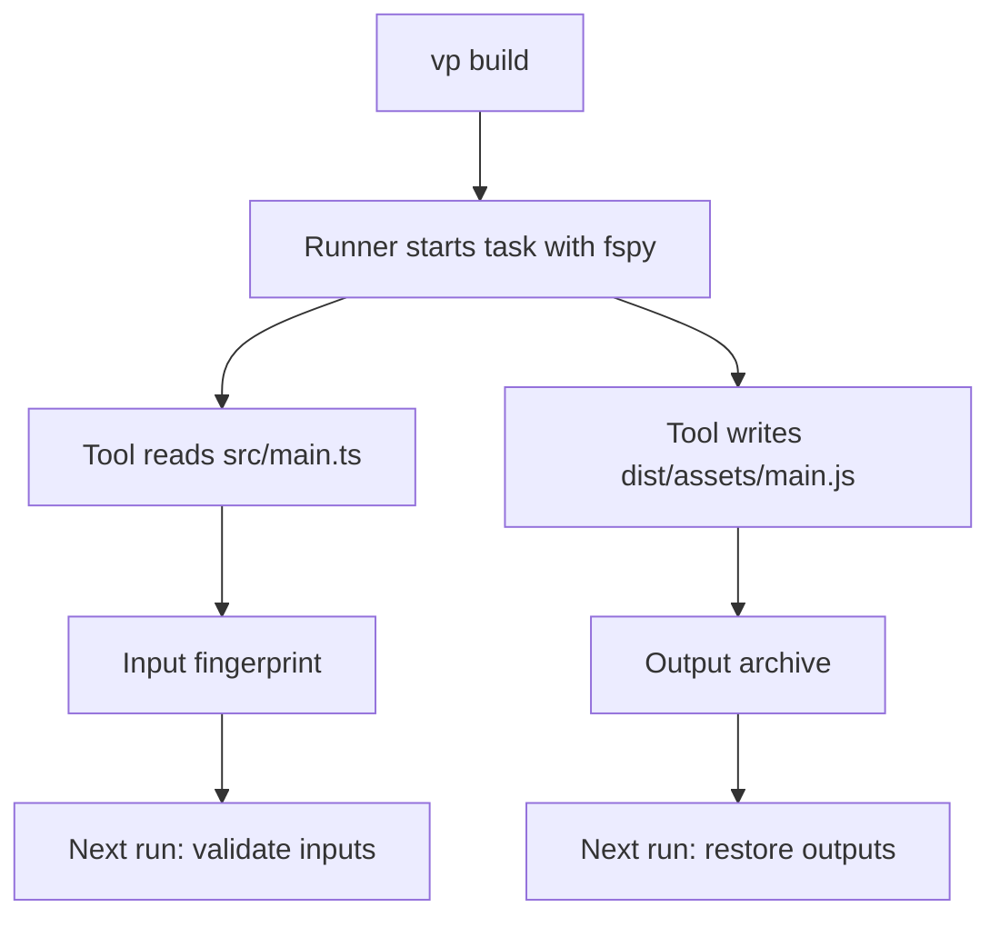
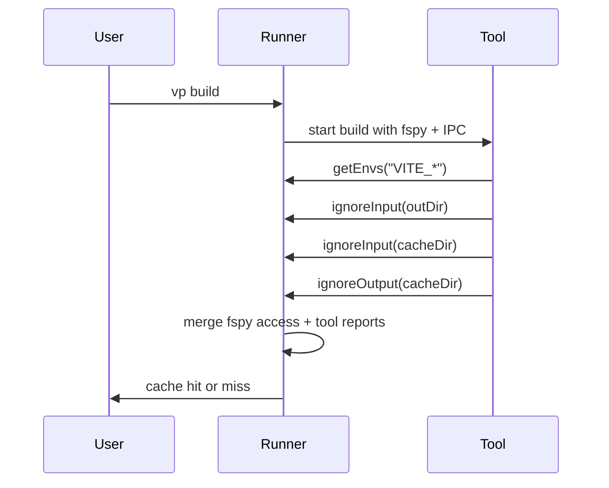
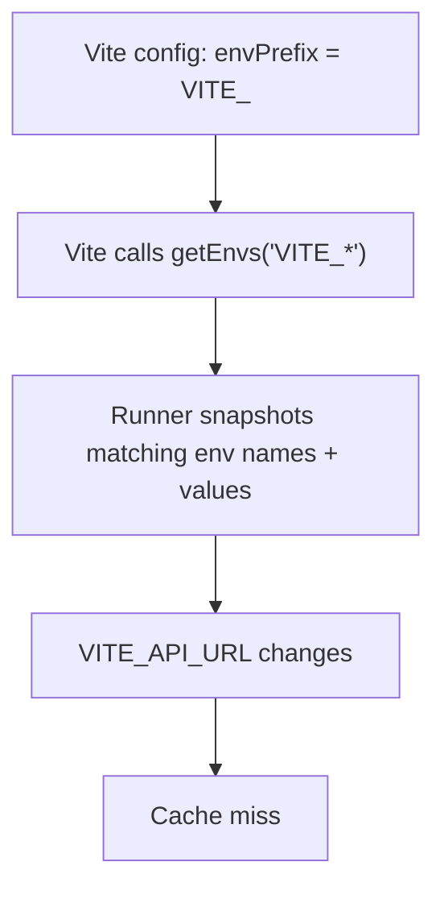
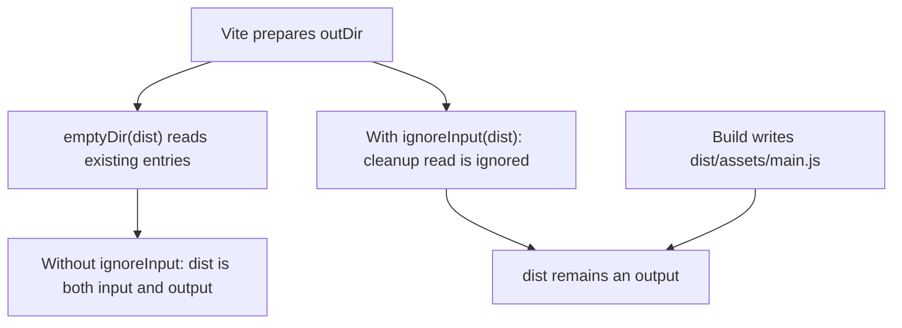
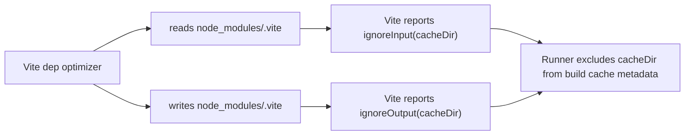
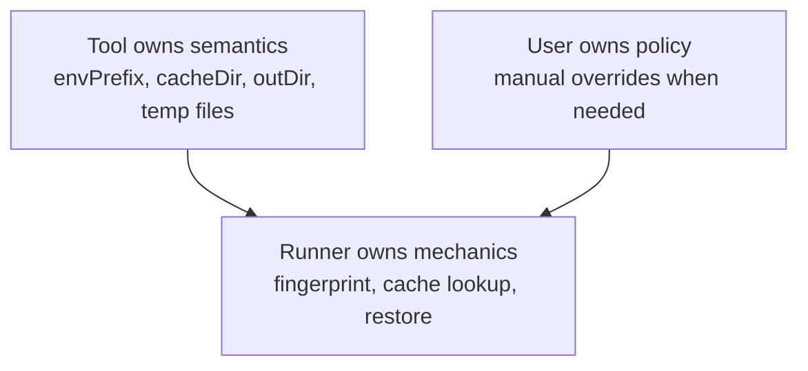

# Runner-Aware Tools in Vite+

`vp build` now has a better source of cache metadata: the tool itself.

Most task runners make the user describe caching behavior:

```json
{
  "tasks": {
    "build": {
      "command": "vp build",
      "input": ["src/**", "index.html", "vite.config.ts"],
      "output": ["dist/**"],
      "env": ["VITE_*", "NODE_ENV"]
    }
  }
}
```

That works, but it puts the burden on the wrong party.

There are three parties:



The user knows the project.

The runner knows how to cache.

The tool knows what actually matters.

## fspy As The Baseline

Vite+ already has automatic inference through fspy.

When a cached task runs, fspy observes file-system access at the syscall level. Reads become inferred inputs. Writes become inferred outputs.



This removes a lot of user config.

But fspy sees access, not intent.

If Vite reads `dist/` before deleting it, fspy sees an input. If Vite writes `node_modules/.vite/`, fspy sees an output. Those facts are technically true, but not the caching semantics the build needs.

## Runner Awareness

Runner awareness lets the tool report intent back to the runner.

Vite imports a tiny client from `@voidzero-dev/vite-task-client`. Outside `vp build`, the calls do nothing. Inside `vp build`, the runner injects an IPC client and records the reports.



This shifts the default responsibility from user config to tool-owned semantics.

The user still has final control through manual `input`, `output`, and `env` config. Tool reports refine automatic inference; they do not erase explicit user choices.

## When Vite Reports Envs

Env vars affect the generated bundle.

Example:

```ts
console.log(import.meta.env.VITE_API_URL)
```

Run one:

```sh
VITE_API_URL=https://staging.example vp build
```

Run two:

```sh
VITE_API_URL=https://prod.example vp build
```

The output should change, so the cache must miss.

Vite already owns the `envPrefix` rule. By default, that means `VITE_*`. So Vite reports matching envs to the runner with `getEnvs("VITE_*")`.



This avoids asking the user to duplicate Vite config in task config:

```json
{
  "env": ["VITE_*"]
}
```

Vite also reports envs like `NODE_ENV` when build resolution depends on them and they are not already present in `process.env`.

Example:

```sh
NODE_ENV=production vp build
NODE_ENV=development vp build
```

Those two builds can resolve different behavior, so the env belongs in the fingerprint.

## When Vite Reports `ignoreInput`

`ignoreInput(path)` means: “if fspy saw reads under this path, do not treat them as cache inputs.”

It is used when a read is an implementation detail, not a build dependency.

Example: before writing `dist/`, Vite may empty it.



The read of `dist/` should not invalidate the next build.

The output files under `dist/` still matter. They are archived and restored on a cache hit.

## When Vite Reports `ignoreOutput`

`ignoreOutput(path)` means: “if fspy saw writes under this path, do not archive them as cache outputs.”

It is used for tool-owned scratch state.

Example: Vite’s dependency optimizer uses a cache directory such as `node_modules/.vite/`.



That directory is not the application build output.

It is Vite’s own optimizer state. Vite already knows how to validate it through its own metadata, so the task runner should not treat it as an input or restored artifact.

## Temporary Files

Some Vite internals create temporary files.

For example, config loading can bundle a config file into a temporary module, write it, import it, then move on.

That file is both read and written during the build, but it is not a project input or build output.

```ts
ignoreInput(tempConfigFile)
ignoreOutput(tempConfigFile)
```

The runner should ignore that file in both directions.

## Manual Config Still Wins

Runner awareness is not a lock-in to tool decisions.

If a user manually declares an input, that input stays part of the cache key.

```json
{
  "tasks": {
    "build": {
      "command": "vp build",
      "input": ["special-generated-file.json"],
      "output": ["dist/**"],
      "env": ["CUSTOM_BUILD_FLAG"]
    }
  }
}
```

Tool reports apply to automatic fspy inference.

Manual config is still the escape hatch when a project has behavior the tool cannot know.

## The Principle

Vite+ caching is moving toward this division of responsibility:



Most task runners ask the user to describe tool internals.

Vite+ uses fspy to infer what happened, then runner-aware tools explain what those observations mean.

The Vite integration is the first step: Vite reports envs, internal cache paths, output cleanup reads, and temporary files from the code paths that own them.

Sources reviewed: [Vite PR #22453](https://github.com/vitejs/vite/pull/22453), [linked proposal](https://github.com/voidzero-dev/vite-task/blob/runner-aware-tools/docs/runner-task-ipc/vite-proposal.md).
