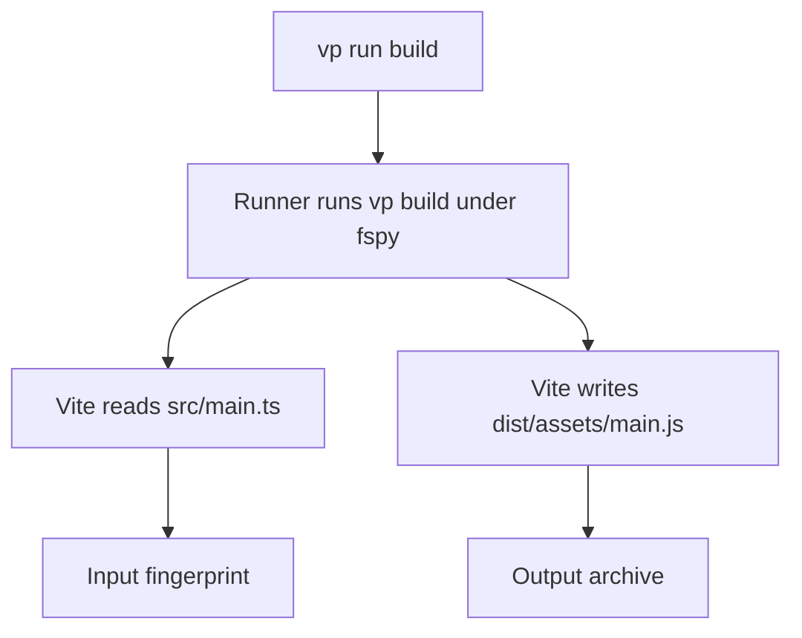
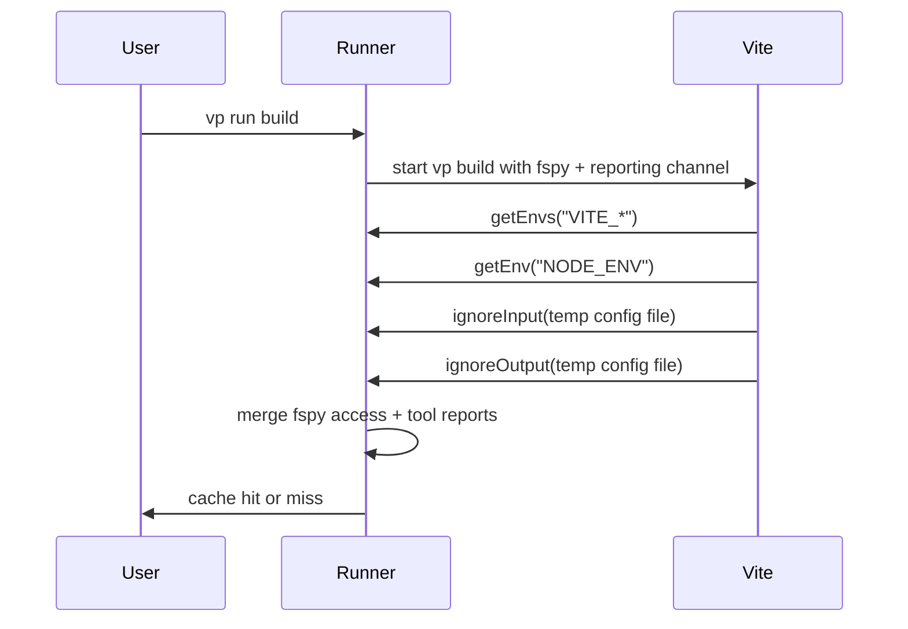
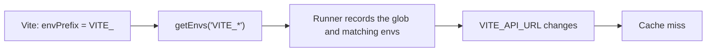
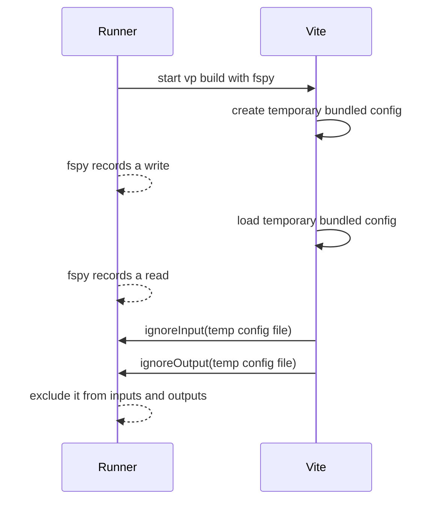
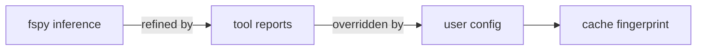
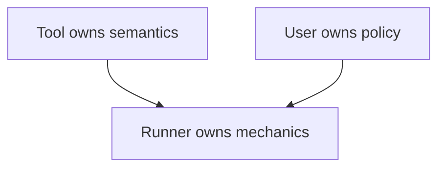

# Tool-Reported Caching

`vp build` now has a better source of cache metadata: Vite itself.

# Background: how caching works

A *task runner* like `vp run` speeds up repeated work by not repeating it.

1. On the first run it records a **fingerprint** (everything that affects the result), and saves the build's output files.
2. On a later run it recomputes the fingerprint; a match means the runner restores the saved files instead of rebuilding (a **cache hit**), and any change means it rebuilds (a **miss**).

The cache is only as good as the fingerprint. Leave something out and you
restore a stale build; put too much in and you rebuild when you didn't need to.


The whole game is **deciding what goes into the fingerprint**.

Most task runners make the **user** answer that:

```json
{
  "tasks": {
    "build": {
      "command": "vp build",
      "input": ["src/**", "index.html", "vite.config.*"],
      "output": ["dist/**"],
      "env": ["VITE_*", "NODE_ENV"]
    }
  }
}
```

It asks **the wrong party**.

## Three parties

- **The user** knows what to run
- **The runner** (`vp run`) knows how to cache.
- **The tool** (`vp build`) knows what actually goes into the fingerprint — and it's the only one that does.

To fill in that config correctly, the user has to know Vite's internals: which
files it reads, that it inlines `VITE_*` into the bundle, that it branches on
`NODE_ENV`. **That knowledge ships with Vite, not with the user.**

## fspy is the baseline

`vp run` already infers most of this.

When a task runs, **fspy** — `vp run`'s *file system spy* — records every
file the task reads and writes, at the operating-system level (tools like Vite don't
need to cooperate). **Reads become inputs. Writes become outputs.**



For a straightforward file-only build, automatic tracking is enough. The user
doesn't need to hand-list files:

```json
{ "tasks": { "build": "vp build" } }
```

But fspy **sees only access, not intent**. It sees too little (env reads are invisible to fspy) and too much (reading/writing temporary files counted as real inputs/outputs).

## Tool-reported caching

Tool-reported caching lets the tool report **intent** to the runner.

Vite imports a tiny client from `@voidzero-dev/vite-task-client`, and reports its caching metadata to `vp run` at runtime ([PR](https://github.com/vitejs/vite/pull/22453)). `vp run` then merges that with fspy's observations to produce a more accurate fingerprint.




## Vite reports env reads

Env vars change the bundle, but fspy can't see them — reading `process.env` is a
memory lookup, not a file access.

```ts
console.log(import.meta.env.VITE_API_URL)
```

```sh
VITE_API_URL=https://staging.example vp build   # run one
VITE_API_URL=https://prod.example    vp build   # run two
```

The bundle differs between the runs, so the cache must miss. But fspy never saw
the env read. Without tool reporting or manual env config, `vp run` has no knowledge of what env vars affect the build, and it won't pass `VITE_API_URL` when spawning `vp build`.

With `@voidzero-dev/vite-task-client`, Vite gets the envs it's interested in from `vp run` at runtime. Vite already owns the `envPrefix` rule (defaults to
`VITE_*` and configurable in `vite.config.ts`), so it hands the runner the match-set with `getEnvs("VITE_*")`; a
change to any matching var then forces a rebuild.



Vite also reports `NODE_ENV` with `getEnv` when build resolution depends on it.
`NODE_ENV=production` and `NODE_ENV=development` resolve different behavior, so
the env belongs in the fingerprint.

The user doesn't need to duplicate Vite's `envPrefix` into task config.

## Vite reports ignoreInput/ignoreOutput

- `ignoreInput(path)`: if fspy saw reads under this path, don't count them as
inputs.
- `ignoreOutput(path)`: if fspy saw writes under this path, don't count them as
outputs.

When Vite loads a config file, it may create a temporary bundled copy first.
That file is an implementation bridge, not part of the project. Vite writes it,
loads it, and then moves on (see
[Vite's docs](https://vite.dev/config/#debugging-the-config-file-on-vs-code)
for details).

fspy sees the temporary file as both a write and a read. If the runner kept that
observation, the cache would fingerprint and archive a file that only existed to
load config for this run.



Vite reports the exact temporary file in both directions. `ignoreInput` keeps it
out of the input fingerprint. `ignoreOutput` keeps it out of the output archive.

## The user still wins

Tool-reported caching refines automatic inference. It does not override the user.

A manual `input`/`output`/`env` entry stays authoritative — even against
`ignoreInput`.

```json
{
  "tasks": {
    "build": {
      "command": "vp build",
      "input": ["special-generated-file.json"],
      "env": ["CUSTOM_BUILD_FLAG"]
    }
  }
}
```

Three layers, each overriding the last:



Manual config is the escape hatch for behavior the tool can't know.

## The principle

The party that knows the cache behavior should declare it.



fspy moved file inputs from the user to the runner's observation.
Tool-reported caching moves the rest — envs, scratch, overlap — from the user
to the tool.

Vite is the first tool to use tool-reported caching, and the first step of
Vite+ tools owning their own caching. The same client is open to any tool in
the ecosystem.
